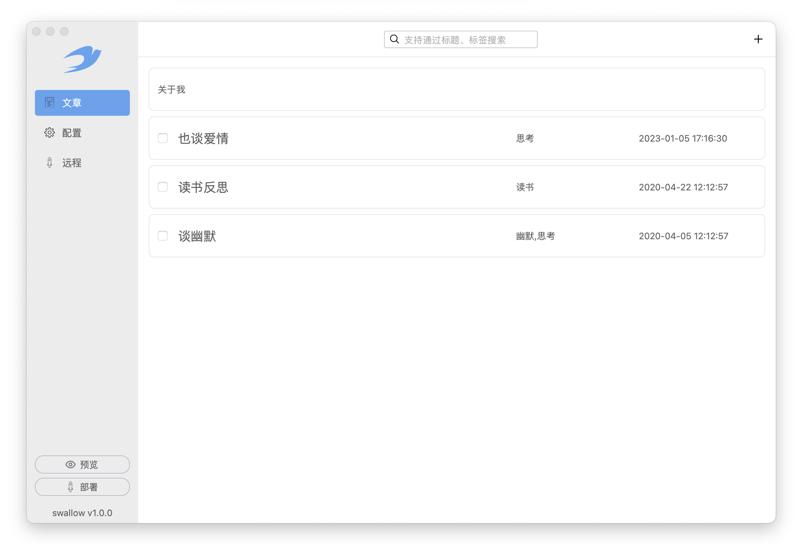
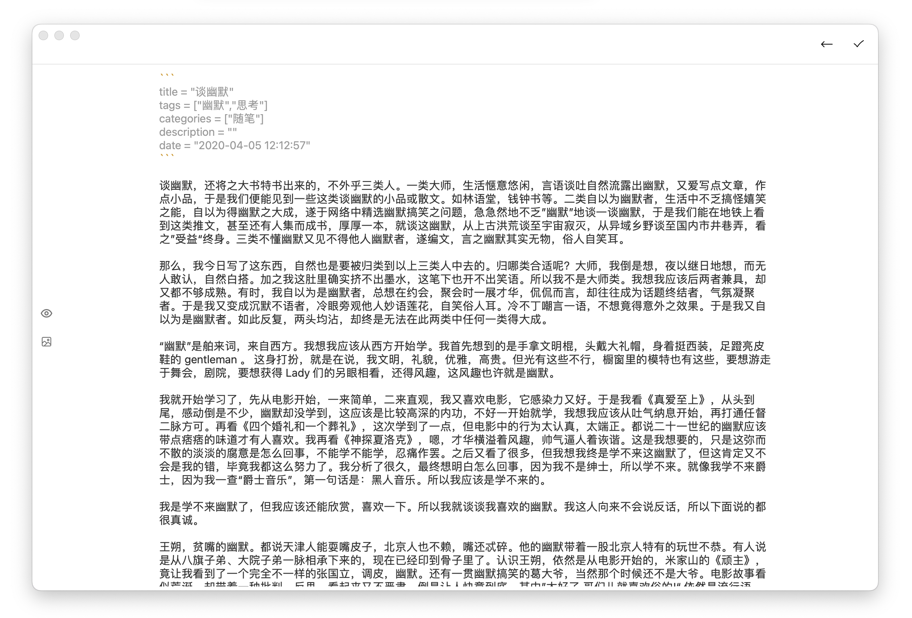
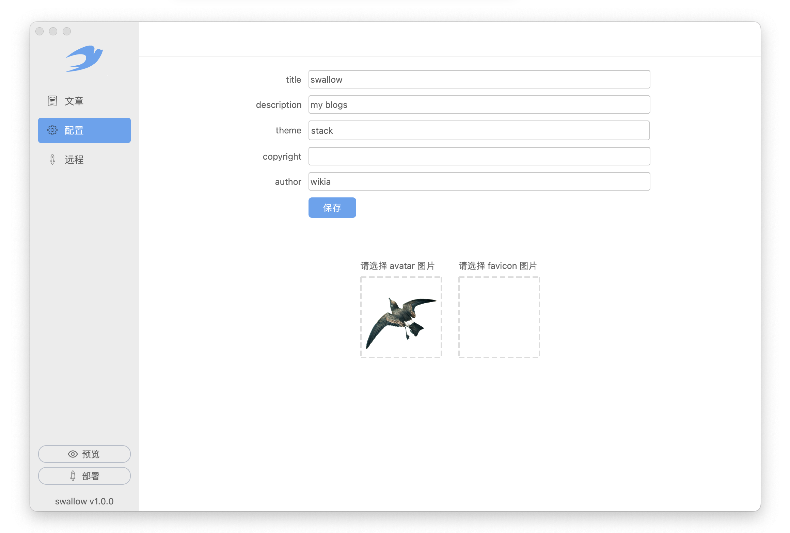
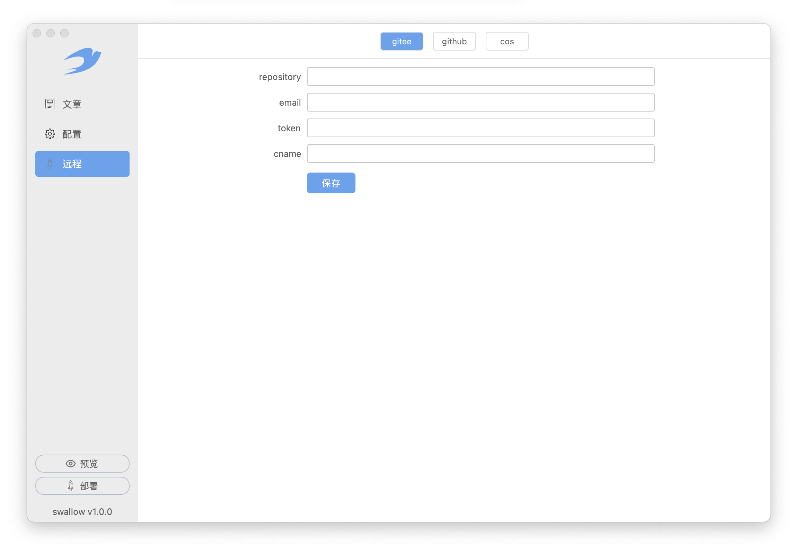
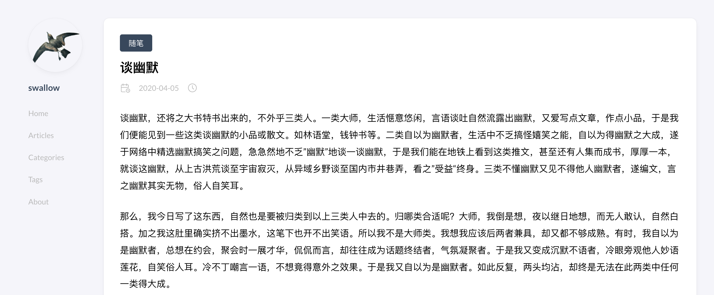

# Swallow

> All those moments will be lost in time, like tears in rain.

Swallow 是一个简单的静态博客写作客户端。Swallow 的宗旨就是`简单`。即使是一个"小白"用户也可以使用 Swallow 搭建自己的博客系统。使用 Swallow。你不需要懂`HTML`、`CSS`、`Javascript`、`网络`
、`命令行`、`配置文件`等等编程和网络相关的知识。

你只需要会使用软件。然后学一点 [Markdown](https://markdown.com.cn/)（一种轻量级标记语言，它允许人们使用易读易写的纯文本格式编写文档）语法。就可以开始创建自己的个人博客网站了。

**开启你的博客之旅吧**

## 特性

- 使用 Markdown 创作你的博客
- 可以对文章分组和添加标签
- 支持 Windows 和 MacOS 客户端
- 可以本地预览博客站点
- 支持多种远程部署方式
  1. [COS（腾讯云对象存储服务）](./doc/cos_deploy.md)
  2. [Github Page](./doc/github_deploy.md)
  3. [Gitee Page](./doc/gitee_deploy.md)
- 支持 Hugo 主题，其中内置主题开箱即用
- 本地存储文章源文件

## 界面

## 开发

> 欢迎各位参与一起开发

### 使用的技术

- [PySide6](https://doc.qt.io/qtforpython/)，qt for python，基于 Python 使用 Qt 开发界面
- [Hugo](https://gohugo.io/)，静态博客生成引擎
- [Nuitka](https://nuitka.net/pages/donations.html)，python 打包工具，将 python 程序打包成 Windows、MacOS 和 Linux 可执行程序

### 详细文档

可以参考作者相关的博客。